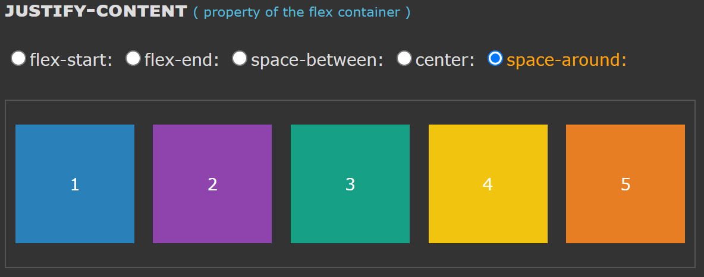
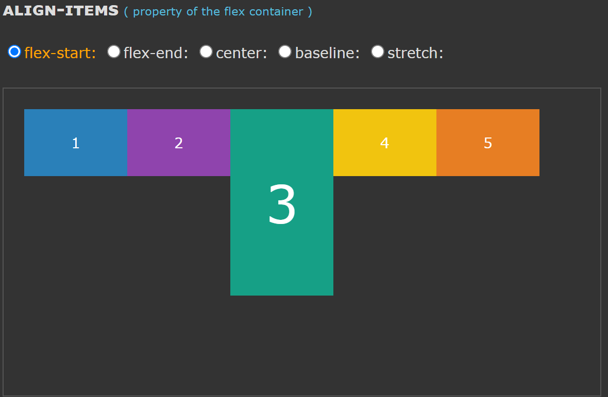

<style>
    .lm {color : #BFFF00;}
</style>

----
### <span class="lm"> 1. HTML Demo: contenteditable</span>

true 또는 빈 문자열은 요소가 편집 가능함을 나타냅니다.
false는 요소가 편집 불가능함을 나타냅니다.

caret-color (en-US) 으로 입력 커서색을 변경 가능

----
### <span class="lm">2. CSS : box-sizing</span>
box-sizing : border-box 으로 지정하면 테두리를 포함한 
width나 height등 박스의 크기를 지정할 수 있기 때문에
예측이 쉬워진다 

----
### <span class="lm">3. CSS : display</span>
justify-content


align-items


----
### <span class="lm">4. CSS : min-height </span>
min-height는 height 속성의 사용값이 자신의 값보다 작아지는걸 방지합니다.
```
<length>
고정 길이로 나타낸 최대 높이. 음수 값은 유효하지 않습니다.
<percentage>
컨테이닝 블록 높이에 대한 백분율로 나타낸 최대 높이. 
음수 값은 유효하지 않습니다.
```
----
### <span class="lm">5. CSS :  vh & vw (vertical height & vertical width)</span>
반응형 웹디자인 테크닉은 퍼센트 값에 상당히 의존하고 있습니다. 
CSS의 너비 값은 가장 가까운 부모 요소에 상대적인 영향을 받습니다.

**브라우저 높이값이 900px일때 1vh는 9px이라는 뜻이 되지요.**
즉, 브라우저 크기에 따라서도 고정적인 폰트 크기를 가진다.

----
### <span class="lm">6. CSS : text-transform</span>

```
none : 입력된 그대로 출력합니다.
capitalize : 단어의 첫번째 글자를 대문자로 바꿉니다.
uppercase : 모든 글자를 대문자로 바꿉니다.
lowercase : 모든 글자를 소문자로 바꿉니다.
initial : 기본값으로 설정합니다.
inherit : 부모 요소의 속성값을 상속받습니다.
```

----
### <span class="lm">7. CSS : webkit</span>

-webkit- : 사파리 ,크롬에서 사용가능;

#### <span class="lm">-webkit-box-reflect (방향) (값) (image)
lets you reflect the content of an element in one specific direction.

value : 
above, below, right, left

----
### <span class="lm">8. CSS : gradient()</span>
&#60;image> 자료형

[그라디언트 사용법](https://developer.mozilla.org/ko/docs/Web/CSS/gradient)

접두옵션
1. (-)linear-
2. (-)radical-
3. (-)conic-
4. repeating-

함수를 검색해보자

### <span class="lm">9. CSS : animation</span>
